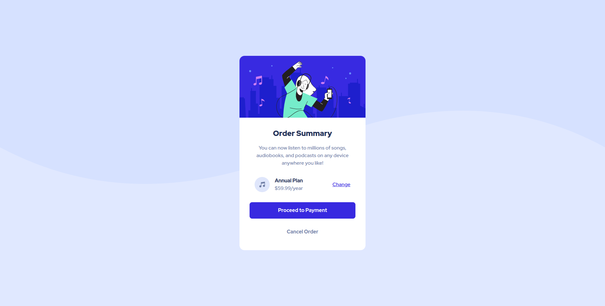

# Frontend Mentor - Order summary card solution

This is a solution to the [Order summary card challenge on Frontend Mentor](https://www.frontendmentor.io/challenges/order-summary-component-QlPmajDUj). Frontend Mentor challenges help you improve your coding skills by building realistic projects.

## Table of contents

-   [Overview](#overview)
    -   [The challenge](#the-challenge)
    -   [Screenshot](#screenshot)
    -   [Links](#links)
-   [My process](#my-process)
    -   [Built with](#built-with)
    -   [What I learned](#what-i-learned)
    -   [Continued development](#continued-development)
    -   [Useful resources](#useful-resources)
-   [Author](#author)

## Overview

### The challenge

Users should be able to:

-   See hover states for interactive elements

### Screenshot



### Links

-   Solution URL: [https://github.com/alvaro-jrr/order-summary-component](https://github.com/alvaro-jrr/order-summary-component)
-   Live Site URL: [http://order-summary-component-henna.vercel.app/](http://order-summary-component-henna.vercel.app/)

## My process

### Built with

-   Semantic HTML5 markup
-   CSS custom properties
-   Flexbox
-   CSS Grid

### What I learned

I'm proud of this CSS, because it shows an specific image as background for mobile and desktop:

```css
.wrapper {
	background: url("./images/pattern-background-mobile.svg") top left / contain
		no-repeat fixed var(--pale-blue);
}

@media (min-width: 1281px) {
	.wrapper {
		background-image: url("./images/pattern-background-desktop.svg");
	}
}
```

### Continued development

I would like to keep focus on Responsive Web Design.

### Useful resources

-   [Josh's Custom CSS Reset ](https://www.joshwcomeau.com/css/custom-css-reset/) - This helped me reset my CSS and gave me more knowledge due the way it works.
-   [CSS Tricks - Background](https://css-tricks.com/almanac/properties/b/background/) - This resource made me understand every background property, this helped me to set the background image with a color.

## Author

-   Github - [Alvaro Resplandor](https://github.com/alvaro-jrr)
-   Frontend Mentor - [@alvaro-jrr](https://www.frontendmentor.io/profile/alvaro-jrr)
